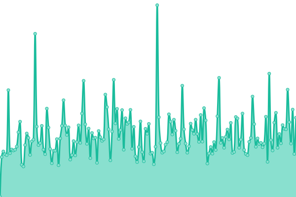

# [📈 Live Status](https://status.jwhite.network): <!--live status--> **🟩 All systems operational**

This repository contains the open-source uptime monitor and status page for [Cyb3r Jak3](www.jwhite.network), powered by [Upptime](https://github.com/upptime/upptime).

With [Upptime](https://upptime.js.org), you can get your own unlimited and free uptime monitor and status page, powered entirely by a GitHub repository. We use [Issues](https://github.com/Cyb3r-Jak3/uptime-stats/issues) as incident reports, [Actions](https://github.com/Cyb3r-Jak3/uptime-stats/actions) as uptime monitors, and [Pages](https://status.cyberjake.xyz) for the status page.

<!--start: status pages-->
<!-- This summary is generated by Upptime (https://github.com/upptime/upptime) -->
<!-- Do not edit this manually, your changes will be overwritten -->
<!-- prettier-ignore -->
| URL | Status | History | Response Time | Uptime |
| --- | ------ | ------- | ------------- | ------ |
|  [Portfolio](https://www.cyberjake.xyz) | 🟩 Up | [portfolio.yml](https://github.com/Cyb3r-Jak3/uptime-stats/commits/HEAD/history/portfolio.yml) | 

 222ms
     
 | 

<a href="https://status.cyberjake.xyz/history/portfolio">100.00%</a>
    

|  [Portfolio (Self Hosted)](https://portfolio.cyberjake.xyz) | 🟩 Up | [portfolio-self-hosted.yml](https://github.com/Cyb3r-Jak3/uptime-stats/commits/HEAD/history/portfolio-self-hosted.yml) | 

 173ms
     
 | 

<a href="https://status.cyberjake.xyz/history/portfolio-self-hosted">100.00%</a>
    

|  [API](https://api.cyberjake.xyz/version) | 🟩 Up | [api.yml](https://github.com/Cyb3r-Jak3/uptime-stats/commits/HEAD/history/api.yml) | 

 111ms
     
 | 

<a href="https://status.cyberjake.xyz/history/api">100.00%</a>
    

|  [Blog](https://blog.cyberjake.xyz) | 🟩 Up | [blog.yml](https://github.com/Cyb3r-Jak3/uptime-stats/commits/HEAD/history/blog.yml) | 

 148ms
     
 | 

<a href="https://status.cyberjake.xyz/history/blog">100.00%</a>
    

|  [Status Site](https://status.cyberjake.xyz) | 🟩 Up | [status-site.yml](https://github.com/Cyb3r-Jak3/uptime-stats/commits/HEAD/history/status-site.yml) | 

 126ms
     
 | 

<a href="https://status.cyberjake.xyz/history/status-site">100.00%</a>
    

|  [DNS API](https://dns.cyberjake.xyz/api/) | 🟩 Up | [dns-api.yml](https://github.com/Cyb3r-Jak3/uptime-stats/commits/HEAD/history/dns-api.yml) | 

 76ms
     
 | 

<a href="https://status.cyberjake.xyz/history/dns-api">100.00%</a>
    

|  [Lookup Client](https://rdap.cyberjake.xyz/) | 🟩 Up | [lookup-client.yml](https://github.com/Cyb3r-Jak3/uptime-stats/commits/HEAD/history/lookup-client.yml) | 

 133ms
     
 | 

<a href="https://status.cyberjake.xyz/history/lookup-client">100.00%</a>
    

|  [Send](https://send.cyberjake.xyz/) | 🟩 Up | [send.yml](https://github.com/Cyb3r-Jak3/uptime-stats/commits/HEAD/history/send.yml) | 

 216ms
     
 | 

<a href="https://status.cyberjake.xyz/history/send">100.00%</a>
    

<!--end: status pages-->

[**Visit my status website →**](https://status.cyberjake.xyz)

## 📄 License

- Powered by: [Upptime](https://github.com/upptime/upptime)
- Code: [MIT](./LICENSE) © [Cyb3r Jak3](https://cyberjake.xyz)
- Data in the `./history` directory: [Open Database License](https://opendatacommons.org/licenses/odbl/1-0/)
